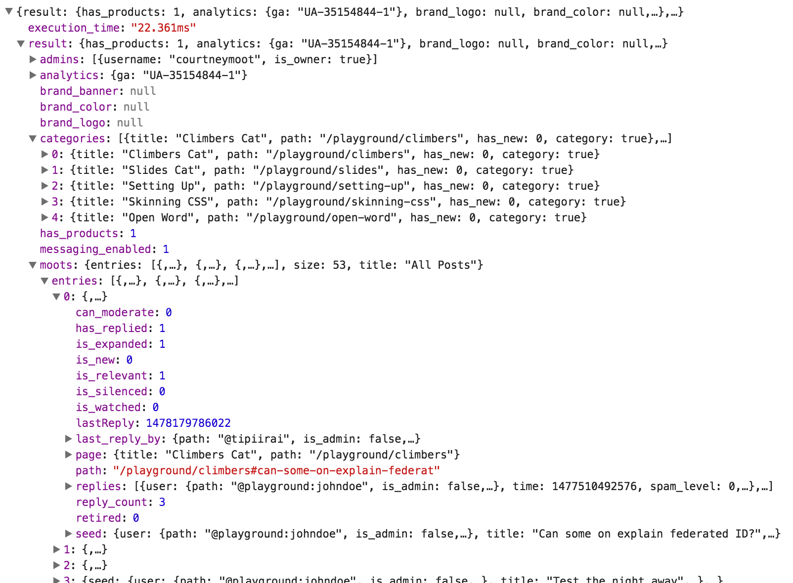

## Overview

This is a low level api for Muut IO. It has the essentials to get quickly started with developing your conversionational application.

It weights only 4kb and has no external dependencies. It works nicely with client side frameworks such as React, Riot or Vue. This repository has a quick "Todo MVC"- like example, that uses the [Riot framework](//riotjs.com). Please look for the demo directory for the relevant files.

The low leve API (muutio.js on the root of this repository) takes care of various things that are common to any kind of real-time application.


## Features

**Session management** so that all calls are authenticated after user logs in.

**Connection management**. If the connection closes, the system is able to reconnect automatically after the computer is re-connected to a network.

**Familiar API** with promise- methods `done`, `fail` and `always` and event emitting `on`, `off`, `one` and `emit`.

**Connection management** with lifecycle events like `ready`, `close` and `reconnect`

**Server sent events** and falling back to longpolling when SSE is not supported.

**Posting images and files** for attaching images and metadata to posts and replies with simple interface.


## Hello, World

Here's a minimal example to get you an idea how things work.

``` js
// initialize "goma" community
muutio('goma', function(data) {

  // the client is ready. use data (pictured below) to render the app


  // authenticate
  $(someElement).click(this.openLogin)

  // make calls...
  this.call('reply', { path: '/goma/gallery#cafe', body: ['Great place!']  }, function() {
    // success

  }).fail(function() {
    // failure

  })

  // reveive events...
  this.on('like', function(event) {
    console.info(event)
  })

})
```

Her's what the initial data for rendering the application looks like:




## Typical application flow

1. Render the application with the initial data

2. User performs login, call `init` and reload the client with the new data. The data is significantly different when logged in, for example the server remembers the threads that user has expanded and feds them with reply information.

3. Perform actions, like post, reply, like, expand, load more replies etc.. A good practise is to render data immediately when it's available. There is no need to wait for response from the server when user replies for example since you already have all the key information available. The post id can be attached to the reply later too. This makes the client feel much more responsive.

4. Listen to server events and update the client accordingly. A good client side framework helps here tremendously. Muut is wise enough to silent all events that originate from the current user. Only other users or other browser tabs will receive events.

5. User performs logout. Most actions aren't permitted for anonymous users (such as posting and liking) so the relevant UI elements should be disabled or hidden.

Please look for the commented [source code](demo/app.html) of our [demo application](//muut.com/io-demo) to see how all the above are tied together.


## Properties

`time_offset` property for checking the difference between client and server


## Events

The client sends various events during the operation. You can capture them as follows

``` js
api.on('like', function(path) {

  // a post was liked

})
```

You can listen to multiple events at once and the event name is provided on the first argument:

``` js
api.on('like unlike', function(event_name, path) {

  // a post was liked or unliked

})
```

Using `one` you'll receive the event once after which the callback is no longer called. For example:

``` js
api.one('init', function(path) {

  // not called when re-initialized

})
```

By using asterisk `*` as the event name you'll receive notifications from all events. This is a good way to study the various events or debug the application.

``` js
api.on('*', function(type) {

  // lets see what comes trough the pipe
  console.info(arguments)

})
```

The `off` method removes the function from receiving events.

### Event listing

Here are possible events that you can listen to:

- `banned` when the current user was banned by the system administartor
- `enter` when a user enters a application
- `join` when the current user registers to the system
- `leave` when user leaves the application
- `like` when a post is liked
- `login` when the current user log's into the system
- `meta` when a post metadata is updated
- `remove` when a post was removed
- `reply` when a new reply was posted to a thread
- `spam` when a post was marked spammed
- `thread` when a new thread was created
- `type` when user is typing a message
- `unlike` when a post is unliked
- `unspam` when a post is unspammed


### Connection events

- `close` when a connection is closed
- `reconnect` when a connection is re-established


## API

The API docs are on this [separate document](API.md)